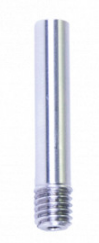
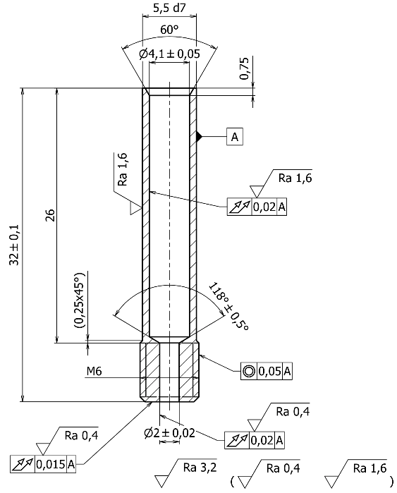
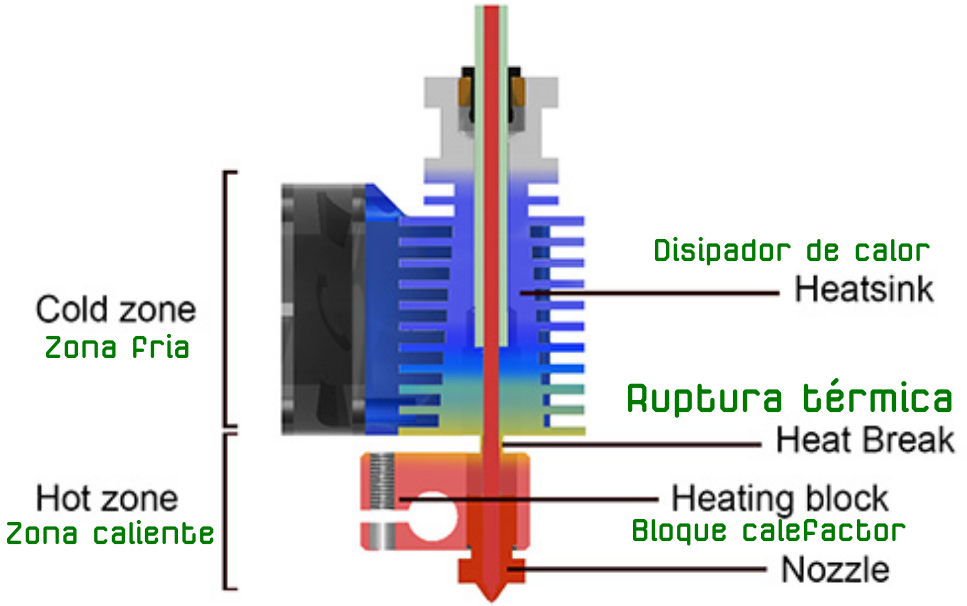

# Análisis del problema
La [Original Prusa MINI+](https://www.prusa3d.es/original-prusa-mini/) es una impresora de tipo bowden de Josef Prusa que viene equipada de fábrica con un heatbreak como el de la imagen 1.

| Imagen 1 |
|:-:|
|  |
| Aspecto del heatbreak original de la Prusa MINI+ |

En la imagen 2 (obtenida de [documentación de las partes mecánicas](https://github.com/prusa3d/Original-Prusa-MINI/blob/master/DOCUMENTATION/MECHANICAL%20PARTS/mini-heatbreak.pdf)) vemos una sección del heatbreak anterior.

| Imagen 2 |
|:-:|
|  |
| Sección del heatbreak original de la Prusa MINI+ |

En la imagen 3 vemos una sección de un hotend donde se muestran las temperaturas dentro del mismo. Esta imagen está basada en la obtenida de [E3D](https://e3d-online.com/).

| Imagen 3 |
|:-:|
|  |
| Sección de un hotend según E3D |

La función de las partes del hotend se resume a continuación:

- El nozzle o boquilla es el elemento a través del cual sale por extrusión el filamento fundido para imprimir.
- El bloque calefactor es el elemento encargado de calentar el nozzle hasta la temperatura de impresión y mantener esta estable.
- El heatbreak es el punto de ruptura térmica y separa la zona caliente de la zona fría.
- El disipador se encarga de mantener refrigerada la zona fría, disipando el exceso de calor transmitido por el bloque calefactor.

El proceso que debe producirse de forma ideal es que en el nozzle, por efecto del bloque calefactor, tengamos filamento fundido para que al ser empujado por el filamento que se introduce en el hotend este pueda salir por el nozzle o boquilla de manera uniforme. Para que esto se produzca de forma eficiente lo que debe ocurrir es que el filamento que está fuera del bloque calefactor se mantenga en su estado original, pero es evidente que este proceso no es totalmente ideal y van a ocurrir dos cosas:

1. El filamento fundido del nozzle puede gotear cuando no se está imprimiendo, cosa que ocurre en los desplazamientos del cabezal, produciendo unos hilitos muy caracteristicos que veremos cuando tratemos la retracción.
2. El filamento por fuera del bloque calefactor estará a una temperatura que lo hará maleable y en las retracciones se pueden producir estiramiento y engrosamientos del mismo en esa zona.

Resulta evidetente que existe una zona de ruptura o barrera térmica entre ambas zonas que no podemos evitar y que va a depender del tipo de heatbreak que tengamos montado.

En el caso del que vemos en la imagen 2 podemos observar que el tubo PTFE encargado de conducir el filamento hasta la zona de barrera está muy cercano a la zona roscada que es la que va el bloque calefactor. Esto, junto con el tipo de material del que está construido hacen que la zona de ruptura térmica se extienda hacía la parte del refrigerador provocando esos atascos tan molestos e indeseados.

Lo ideal sería mantener el filamento fundido en el bloque calefactor y rígido justo por encima de la barrera térmica en el bloque refrigerador teniendo tan solo que solucionar el tema de los goteos no deseados y se ha puesto en evidencia, al menos en mi caso, que este heatbreak no resulta muy eficiente para este tema, siendo la mejor solución cambiarlo por otro de mejor calidad, tal y como vamos a ver en el apartado [Descripción de la solución adoptada](solucion.md)

Sospechando que los continuos atascos que se producían, con el consiguiente inconveniente de impresiones fallidas y perdidas de tiempo en quitarlos, tenían su procedencia en el hotend y sabiendo que el gran Miguel Angel de [THE MAKER 3D PRINTING](https://www.youtube.com/channel/UC5w9OHmq3g9VCMzxCxoRjjg) ya había trabajado con la Prusa MINI+ me puse en contacto con él y en los primeros treinta segundos de conversación ya estaba confirmado que el problema estaba en ese heatbreak que monta y también me aportaba la solución. Por tanto, analizado el problema, queda meterse en la solución dada al mismo.
