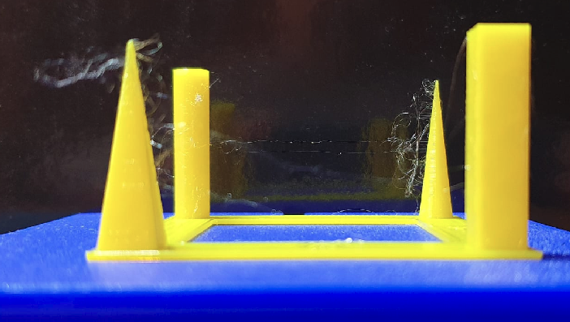
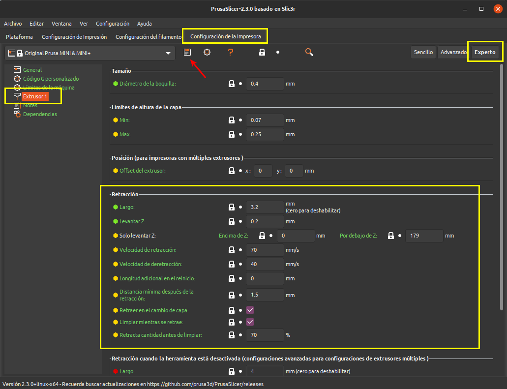
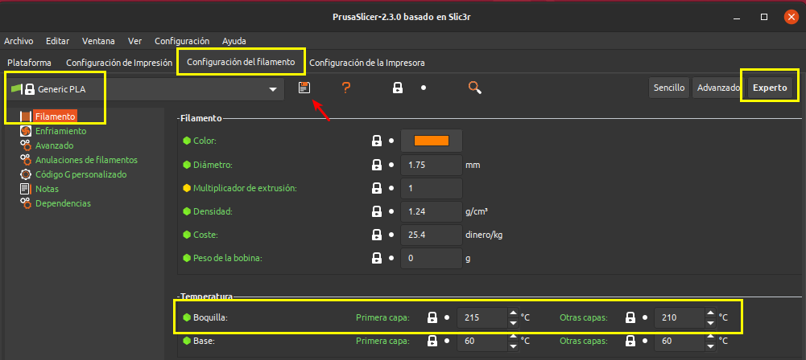
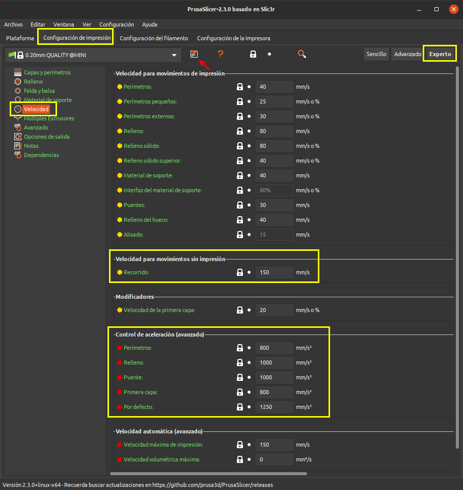
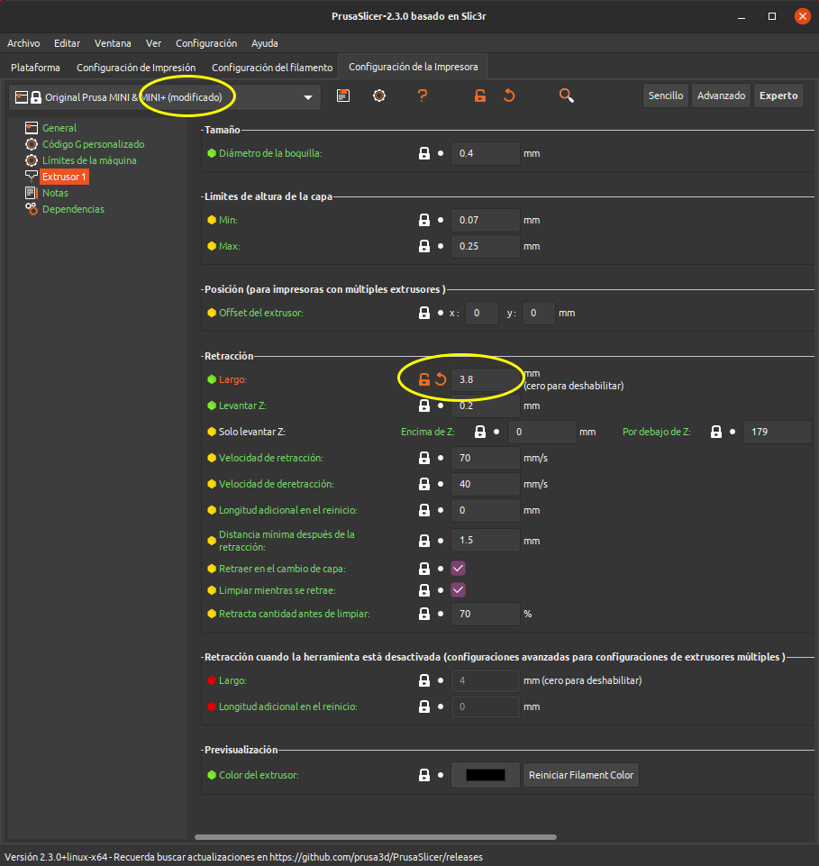
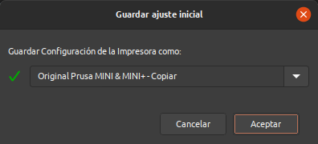
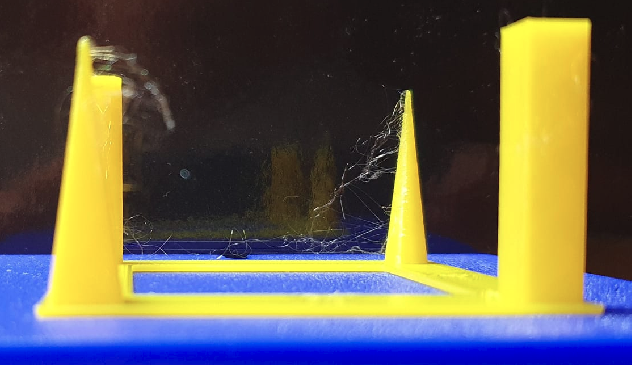
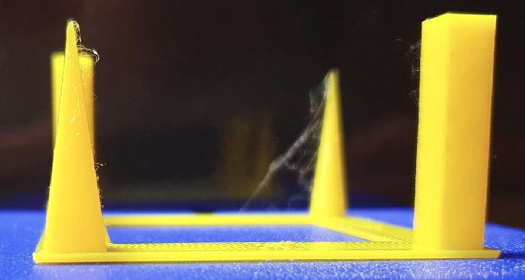
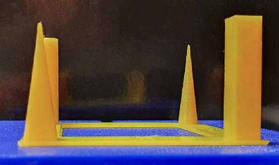

# A vueltas con la retracción
Vamos en primer lugar a describir el tema conocido como Stringing (Encordado) u Oozing (rezumado o goteo).

Al imprimir objetos, o partes de estos, separados por un espacio libre quedan unos pelillos molestos y que afean bastante la impresión, incluso pueden llegar a ser excesivos. Esto es lo que se conoce como Strining o Encordado. Es decir, son los pelillos que quedan en nuestras impresiones y que no son deseados. En la imagen 1 vemos claramente de que estamos hablando.

| Imagen 1 |
|:-:|
|  |
| Ejemplo de stringing |

Indicar que la pieza de la imagen 1 está diseñada especialmente para la detección de estos problemas. En el enlace tienes el [archivo stl](3D/pieza-final-prueba-retraccion.stl) listo para descargar e imprimir y en este otro enlace tienes el [archivo fuente](3D/retraccion.FCStd) de FreeCAD por si quieres realizar modificaciones.

La pieza anterior está basada en la idea de Miguel Angel de [THE MAKER 3D PRINTING](https://www.youtube.com/channel/UC5w9OHmq3g9VCMzxCxoRjjg) que puedes encontrar [en este enlace]([THE MAKER 3D PRINTING](https://www.thingiverse.com/thing:3420677).

En los dos videos siguientes se dan muchas explicaciones sobre el tema y aconsejo encarecidamente su visualización.

1. [Retracción: concepto y pruebas](https://www.youtube.com/watch?v=Sqd2CzC1nmI)
2. [¿MUCHOS HILITOS? SOLO DI ¡¡¡NO!!! / AJUSTAR RETRACCIÓN](https://www.youtube.com/watch?v=x8GNs6GZduc)

## ¿A que se debe el Stringing?
Podemos decir que en general, no es un problema físico de la propia impresora sino que es un problema debido a la retracción del filamento. Se produce cuando se acaba de imprimir la capa de uno de los pilares y el cabezal se tiene que desplazar a otro lugar mientras sigue saliendo material fundido por el nozzle.

El problema lo soluciona la retracción, que se utiliza en impresión 3D para detener, o al menos intentarlo, el flujo de filamento fundido cuando la boquilla debe moverse entre lugares con espacios vacíos.

El tema de retracción consiste básicamente en actuar sobre la presión en la boquilla de forma que cuando se realiza una retracción, la presión sea nula o incluso algo negativa evitando así que el filamento fundido salga del nozzle.

Resulta evidente que la longitud de retracción va a ser un parámetro determinantes en el resultado final, pero no es el único y tampoco podemos hacerlo excesivamente grande porque el filamento que está en la parte fría junto a la zona de ruptura aunque no esté derretido si estará lo suficientemente blando como para estirarse y perder su diámetro característico. En extrusores tipo Bowden los valores normales suelen oscilar entre 2 y 7 mm para la longitud de retracción, pero es algo que depende de la longitud del tubo de PTFE. A mayor longitud de tubo Bowden se requiere más longitud de retracción para compensar. Los extrusores directos suelen usar una longitud de retracción menor. 

## ¿Que parámetros influyen en la retracción?
En el caso de PrusaSlicer la mayoría los tenemos en la pestaña *Configuración de la impresora* seleccionando el apartado Extrusor 1 siempre que estemos en modo experto, tal y como vemos en la imagen 2.

| Imagen 2 |
|:-:|
|  |
| Parámetros de retracción en PrusaSlicer |

Ajustar correctamente la retracción es un proceso iterativo de ajuste de estos parámetros. Vamos en primer lugar a describir lo que significa cada uno de ellos para posteriormente intentar exponer un proceso a seguir.

* **Largo (Length):** distancia en milímetros a retraer medida en el filamento sin procesar, antes de que entre en el extrusor. En general, se recomienda un valor de entre 1 y 2 mm para extrusión directa y hasta 4 o 5 mm en las tipo Bowden.
* **Levantar Z (Lift Z):** levanta el eje Z la longitud especificada durante los recorridos o travels. Esto es muy útil y asegura que la punta de la boquilla no se enganche con ningún filamento ya depositado. Hay que tener presente que activar este parámetro ralentiza la velocidad de impresión. Valores entre 0.1 y 0.2mm son suficientes.
* **Solo levantar Z:** para trabajar con un valor de Z absoluto y permite ajustar la configuración para omitir el levantamiento de Z en las primeras capas.
* **Velocidad de retracción (Speed):** velocidad a la que el motor del extrusor retraerá el filamento. El valor se puede establecer tan alto como nuestra impresora pueda manejar sin perder pasos. Este cambio de velocidad solamente se aplica al motor del extrusor.
* **Velocidad de deretracción:** es la velocidad de carga del filamento en el extrusor después de la retracción. Se aplica solamente al motor del extrusor y si se pone a cero su valor se hace coincidir con el de la velocidad de retracción.
* **Longitud adicional en el reinicio (Extra length on restart):** añade una longitud adicional de filamento después de compensar la retracción tras el movimiento de desplazamiento. Esta configuración solamente se recomienda utilizarla si en nuestra impresión vemos síntomas de que falta material después de los recorridos y, en cualquier caso, siempre se añadirán cantidades muy pequeñas de material.
* **Distancia mínima después de la retracción (Minimum travel after retraction):** la retracción no se activa cuando el movimiento de desplazamiento es menor que esta longitud. La retracción no es necesaria para movimientos de muy escaso recorrido porque el rezumado es insignificante y ralentiza los tiempos de impresión.
* **Retraer en el cambio de capa (Retract on layer change):**  si seleccionamos este parámetro estamos obligando a una retracción cada vez que se realiza un movimiento en Z. Es muy probable que si no activamos la opción el rezumado por movimiento a lo largo del eje Z cree burbujas o gotas en nuestra impresión.
* **Limpiar mientras se retrae (Wipe before retract):** si está activado la boquilla se mueve durante la retracción para reducir las posibilidades de que se forme una gota por rezumado.
* **Retracta cantidad antes de limpiar:** se usa en extrusores Bowden y lo que hace es realizar una retracción rápida antes de realizar los movimientos de limpieza.

Otro parámetro que puede ser interesante modificar es la temperatura de impresión, en este caso bajándola un poco para hacer que el filamento fundido sea algo mas viscoso. En la imagen 3 vemos donde modificar este parámetro para el caso de un filamento PLA genérico.

| Imagen 3 |
|:-:|
|  |
| Temperatura de impresión para la boquilla |

Finalmente también pueden afectar a la retracción la velocidad en los recorridos sin impresión o travel y los valores establecidos para el control de la aceleración, tal y como se indica en la imagen 4.

| Imagen 4 |
|:-:|
|  |
| Ajustes de travel y aceleración |

Observamos que hay que realizar ajustes en las tres pestañas de configuración de parámetros que nos presenta PrusaSlicer y no debemos olvidar guardar dichos cambios haciendo clic en el símbolo indicado con una flecha roja en las imágenes 2, 3 y 4 anteriores. En el momento que modificamos algún parámetro en su valor establecido por defecto se abrirá el candado que lo acompaña y el nombre dado a la configuración nos indica un cambio añadiendo la palabra *modificado escrita entre paréntesis* al nombre original. En la imagen 5 vemos un ejemplo de esto.

| Imagen 5 |
|:-:|
|  |
| Avisos de modificaciones de parámetros originales |

Al pulsar en el icono se nos muestra la ventana que vemos en la imagen 6, donde podemos aceptar el nombre ofrecido por defecto o cambiarlo según nuestras preferencias.

| Imagen 6 |
|:-:|
|  |
| Ventana de guardado del ajuste |

## Ajustes para la Prusa MINI+ con heatbreak modificado
En la tabla siguiente se relacionan los parámetros vistos anteriormente y se ponen los de la configuración original para así poder compararlos.

| Parámetro | Valor original | Valor modificado | Unidades |
|---|:-:|:-:|:-:|
| Largo | 3.2 | 4.7 | mm |
| Levantar Z | 0.2 | 0.2 | mm | 
| Solo levantar Z | 0 / 179 | 0 / 179 | mm |
| Velocidad de retracción | 70 | 75 | mm/s |
| Velocidad de deretracción | 40 | 75 | mm/s |
| Longitud adicional en el reinicio | 0 | 0 | mm |
| Distancia mínima después de la retracción | 1.5 | 6 | mm |
| Retraer en el cambio de capa | Seleccionado | Seleccionado | check |
| Limpiar mientras se retrae | Seleccionado | No seleccionado | check |
| Retracta cantidad antes de limpiar | 70 | 70 | % |
| Velocidad para movimientos sin impresión | 150 | 190 | mm |
| Control de aceleración por defecto | 1250 | 1500 | mm/s2 |

## Procedomiento seguido de ajuste de la retracción
Partiendo de los valores que vienen configurados por defecto y realizo la primera impresión y se obtiene el resultado que se mostró en la imagen 1, donde se observan bastantes pelillos, aunque la verdad sea dicha es que para los cambios realizados la impresión está bastante bien.

El procedimiento seguido ha consistido en:

* Aumento del **largo** de retracción a 3.8mm, la **velocidad de retracción** a 70 mm/s y aumento de la velocidad de **travel** a 180 mm/s. Con estos valores obtengo los resultados que se observan en la imagen 7. Se ha puesto la imagen 1 al lado para comparar fácilmente los cambios.

| Imagen 1 | Imagen 7 |
|:-:|:-:|
|  |  |
| Ejemplo de stringing | Primeros ajustes |

Podemos ver que hay cierta mejora pero no resulta demasiado apreciable y aún hay muchos pelillos, así que modifico los ajustes a nuevos valores y además modifico la temperatura de impresión para la boquilla.

* Aumento del **largo** de retracción a 4.4mm, la **velocidad de retracción** a 70 mm/s, aumento de la velocidad de **travel** a 180 mm/s y disminuyo la temperatura de impresión de la primera capa a 210 ºC y de las otras capas a 205 ºC. Con estos valores obtengo los resultados que se observan en la imagen 8. Se ha puesto la imagen 7 al lado para comparar fácilmente los cambios.

| Imagen 7 | Imagen 8 |
|:-:|:-:|
|  |  |
| Primeros ajustes | Nuevos ajustes |

Aunque se aprecian mejoras aún quedan algunos pelillos por lo que procedo a realizar un nuevo ajuste donde establezco los valores finales indicados en la tabla anterior que conducen al resultado que vemos en la imagen 9.

| Imagen 9 |
|:-:|
|  |
| Ajustes finales |

El resultado obtenido es excelente y los ajustes se han realizado utilizando filamento PLA marca Eolas. A la fecha de publicación de esta entrada no he realizado pruebas con filamento de otros materiales aunque si de otras marcas.
