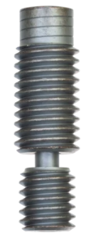
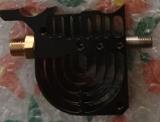
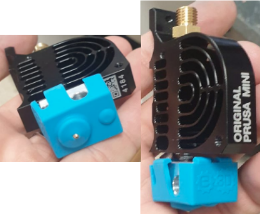
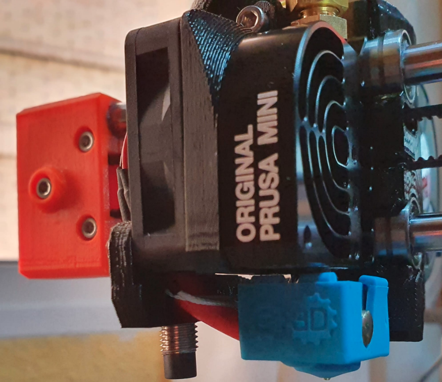

# Descripción de la solución adoptada
En este apartado no voy a extenderme practicamente nada dado que en los videos de los enlaces dados en la [webgrafía](Miscelanea/webgrafia.md) está perfectamente descrito el proceso de solución. Me limitaré por tanto a indicar los cambios realizados en mi caso.

La solución es cambiar el heatbreak por el Copperhead Heat Break Bimetal de [Slice Engineering](https://www.sliceengineering.com/collections/replacement-parts/products/copperhead%E2%84%A2-heat-break) que vemos en la imagen 1.

| Imagen 1 |
|:-:|
|  |
| Aspecto del heatbreak Copperhead Bimetal de Slice Engineering |

Para ello procedo a desmontar el sistema en la Prusa MINI+ siguiendo las instrucciones que se encuentran en el vídeo de [GOVAJU 3D Printing](https://www.youtube.com/channel/UCeOH9RFx6m0j1qRp9KvSsXA) titulado [La MEJOR MEJORA para tu PRUSA MINI/ MINI +](https://www.youtube.com/watch?v=aJHOF3km6SE) y las dadas en [Cómo cambiar un bloque calentador/heatbreak- (MINI/MINI+)](https://help.prusa3d.com/es/guide/como-cambiar-un-bloque-calentador-heatbreak-mini-mini_122769) de la base de conocimiento de Prusa.

Para llevar a cabo la tarea es necesario realizar un taladro con una broca de 6mm en el refrigerador de aluminio, lo que es muy conveniente hacer con un taladro de columna, disponer de un macho de roscar M7 con paso de 1mm y un giramachos. En mi caso no dispongo de todas estas herramientas así que acuerdo con Miguel Angel enviarle los componentes desmontados y que el me haga las tareas de mecanizado.

La sorpresa cuando me devuelve el sistema es que además de cambiar el Heatbreak ha puesto un bloque calefactor de E3D con su calcetín original, colocado el tupo PTFE cortado a medida y mecanizado es sus extremos para evitar escalones y montado todo el conjunto listo para volver a montar en la impresora y comenzar a imprimir.

Desde luego tengo que destacar aquí que el trabajo realizado por Miguel Angel [THE MAKER 3D PRINTING](https://www.youtube.com/channel/UC5w9OHmq3g9VCMzxCxoRjjg) es de la profesionalidad que un gran experto en la materia sabe realizar.  Mil gracias por la ayuda prestada, eres muy GRANDE.

En la imagen 2a vemos el material tal y como fue enviado y en la imagen 2b lo que me devuelve.

| Imagen 2a | Imagen 2b |
|:-:|:-:|
|  |  |
| Material enviado | Material recibido |

En la imagen 3 vemos el conjunto montado en la impresora.

| Imagen 3 |
|:-:|
|  |
| Aspecto del hotend ya modificado y montado en su lugar |

La tarea inicial una vez montado el sistema es el ajuste en vivo de la altura de la primera capa, tarea muy simple de manejar con el asistente que incorpora la Prusa MINI+.

Una vez realizada la tarea anterior comienzo las impresiones de prueba observando como todo va perfecto a excepción del tema del ajuste de la retracción que tiene PrusaSlicer que no es adecuado para el nuevo heatbreak y que hay que proceder a modificar. En el apartado [A vueltas con la retracción](retraccion.md) realizo una descripción completa del tema y como he llegado a la solución en el caso de la Prusa MINI+.
